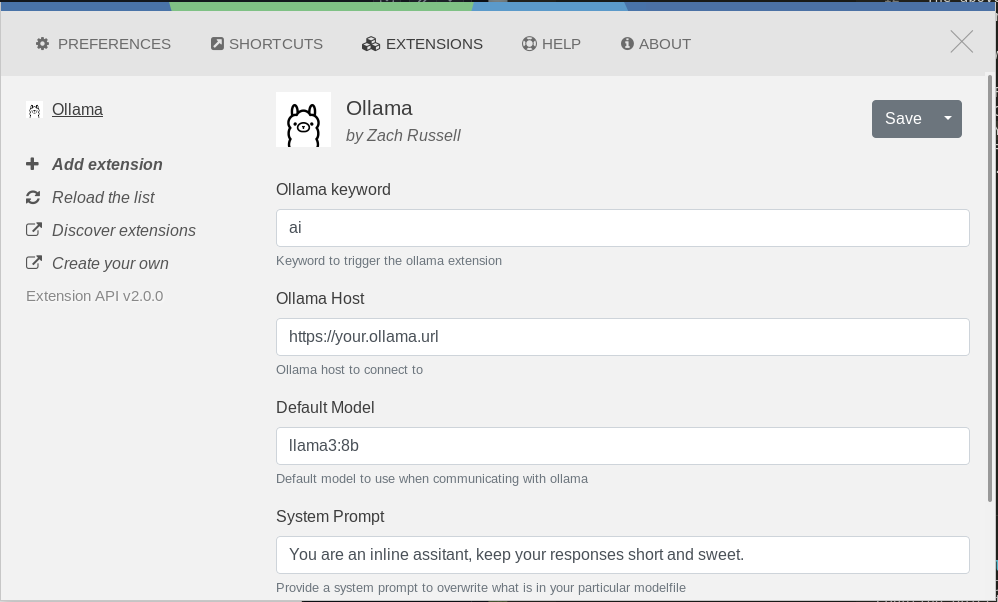

  

  

## Ulauncher Ollama ##

This is an extension for [ULauncher](https://ulauncher.io/). That allows you to generate responses from your self hosted ollama instance.

### Features
- Provide custom headers to all Ollama requests. Particularly useful if you use Cloudflare Zero Trust to auth against your Ollama API
- Configurable system prompts
- Ability to set a default model
- View and interact with all models in your ollama instances 

### Settings

  

